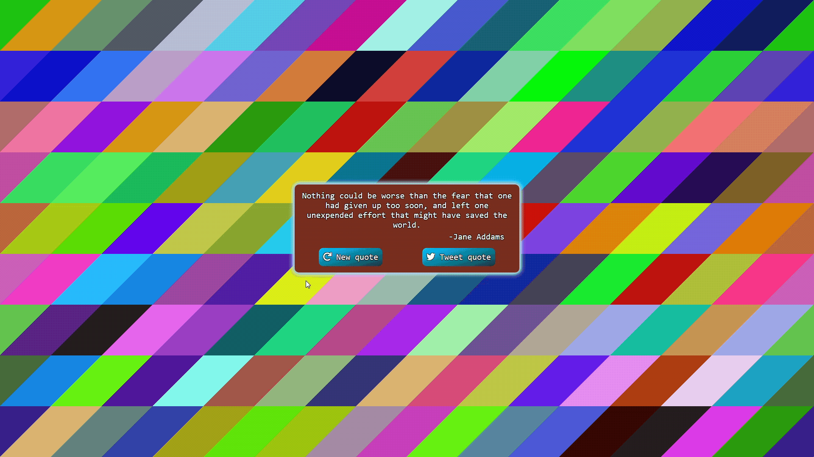

# Random quote machine 
> App that randomly generates canvas background and quotes.
> [Live demo here](https://username1111111111.github.io/Random-Quote-Machine/)
> Or 👇:
> 

## Table of Contents
* [General Info](#general-information)
* [Technologies Used](#technologies-used)
* [Features](#features)
* [Screenshots](#screenshots)
* [Usage](#usage)
* [Contact](#contact)

## General Information
- This was done as one of my FreeCodeCamp graduate projects
- It was inteded for practice with canvas and meeting criteria for the  graduate project

## Technologies Used
- Canvas
- SCSS
- Fontawesome
- window.crypto.getRandomValues()

## Features
-  Canvas background are generated by dividing screen by sectors of pixels with a little shift of pixels (that makes it angled). Amount of sectors can be changed as well as pixel 'shift', to change angle (or make it 90 degrees)
- Quotes are taken by fetching from txt file
- Currently displayed quote can be tweeted with 'intent'
- Randomizing done with both secure and insecure methods

## Screenshots

## Usage
Just clone the repo and open **index.html** in a browser 👍

## Contact

<a style="text-decoration: none;"href="https://github.com/Username1111111111/Username1111111111">@Username1111111111</a>
 
  
The Frontend developer 

    💪

>>>>>>> New README
